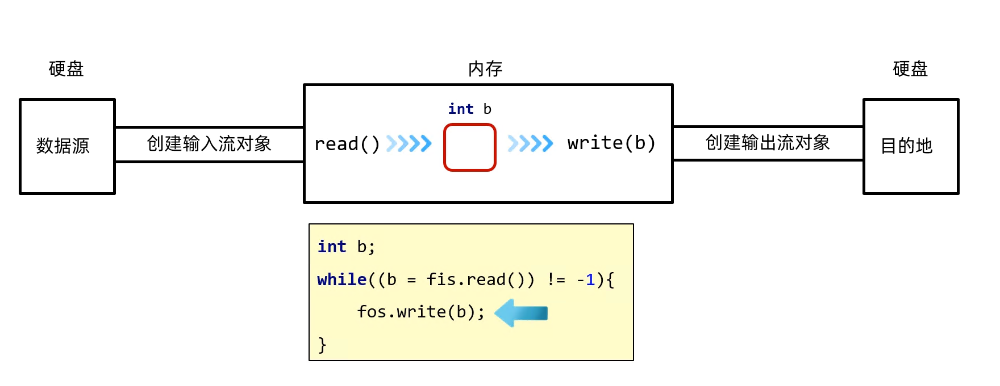
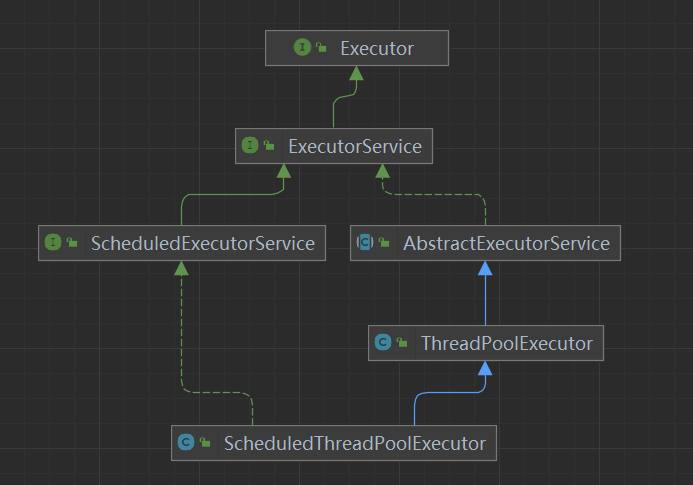
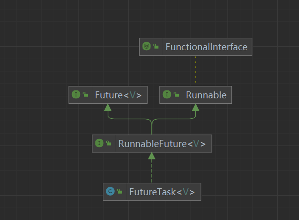
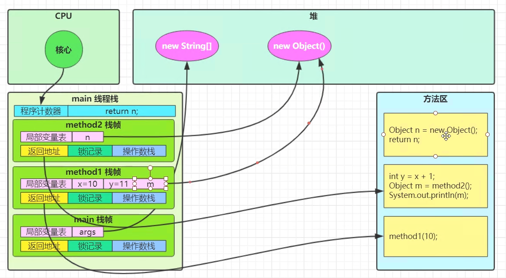

## java 基础

### io

#### 基本介绍

输入流 ,输出流  
字节流，字符流  
非阻塞io，异步io

#### 常用类

OutputStream  
|- FileOutputStream

InputStream  
|- FileInputStream

Reader  
|- FileReader

Writer  
|- FileWriter

#### 常用方法

OutputStream  
|- FileOutputStream  
| |- #FileOutputStream

InputStream  
|- FileInputStream

Reader  
|- FileReader

Writer  
|- FileWriter

#### 代码示例

```java
/**
 * @author 张强
 * @since 2025/5/7 10:17
 */
public class OutputStream {

    /**
     * @param 无
     * @return 无
     * @auther 张强
     * @since 2025/5/7 10:54
     */
    @Test
    public void test1() throws IOException {
        // 创建File对象，指向指定路径的文件
        File file = new File("D:\\coding\\uncertain-test\\src\\main\\resources\\a.txt");
        // 创建FileOutputStream对象，用于写入文件
        FileOutputStream fos = new FileOutputStream(file, false);
        // 定义待写入的字符串
        String str = "hello world";
        // 将字符串转换为字节数组，并从索引1开始，写入3个字节到文件中
        fos.write(str.getBytes(), 1, 3);
        // 关闭文件输出流
        fos.close();
    }

    @Test
    public void test2() throws IOException {
        FileInputStream fis = new FileInputStream("D:\\coding\\uncertain-test\\src\\main\\resources\\a.txt");
        while (fis.available() > 0) {
            System.out.println((char) fis.read());
        }
    }

}
```

### 反射

#### 基本介绍

反射是java语言提供的一种动态获取类信息的机制  
. 获取公共的成员变量, 公共的成员方法, 构造方法  
. 通过设置属性可访问性为ture获取私有的成员变量, 私有的成员方法, 私有的构造方法

#### 常用类

|- Class  
|- Field  
|- Method  
|- Constructor

#### 代码示例

```java
public class ReflectTest {

    @Test
    public void test1() throws ClassNotFoundException {
        Class<?> aClass = Class.forName("crelle.test.java.auxiliary.beans.Student");
        Method[] methods = aClass.getMethods();
        for (Method method : methods) {
            System.out.println(method.getName());
        }
    }

    @Test
    public void test2() {
        Student student = new Student();
        Class<? extends Student> aClass1 = student.getClass();
        Method[] methods = aClass1.getMethods();
        for (Method method : methods) {
            System.out.println(method.getName());
        }
    }

    @Test
    public void test3() throws InvocationTargetException, InstantiationException, IllegalAccessException {
        Class<?> aClass = Student.class;
        Constructor<?>[] constructors = aClass.getConstructors();
        Student student = (Student) constructors[0].newInstance();
        student.setName("zhangsan");
        student.setAge(19);
        System.out.println(student.getName());

    }
}
```



### 泛型

### 注解

### 集合

### 并发编程
1. 线程与进程  
进程:进程可以视为程序的运行实例，大部分的程序都是运行在进程内的，进程是操作系统资源分配的基本单位。  
线程:而线程是进程的运行单元。
2. 并行,并发 
并发:多个线程同时操作一个资源。  
并行:一个线程同时操作多个资源。
3. 异步与同步  
同步：需要等待其他线程操作完毕后才能继续操作。  
异步：不需要等待其他线程操作完毕就可以继续操作。
4. 单核与多核  
单核:一个CPU核串行执行。  
多核:多个CPU核并行执行。

#### 常用类
Object  
|- java.lang.Thread  
|- java.lang.Runnable  
|- java.util.concurrent.Callable  
|- java.util.concurrent.Future  
|- ThreadPoolExecutor  
|- java.util.concurrent.Executor  
| | - java.util.concurrent.ExecutorService  
| | | - java.util.concurrent.ScheduledExecutorService  
| | | |- java.util.concurrent.ScheduledThreadPoolExecutor
|- Executors  
|- CountDownLatch  
|- CyclicBarrier  



#### java中手动创建线程的三种方式
```java
public class ThreadTest {
    @Test
    public void test1() {
        Thread thread1 = new Thread("t1") {
            @Override
            public void run() {
                System.out.println("11111");
            }
        };
        thread1.start();
    }

    @Test
    public void test2() {
        Runnable runnable = new Runnable() {
            @Override
            public void run() {
                System.out.println("22222");
            }
        };
        Thread thread2 = new Thread(runnable);
        thread2.setName("t2");
        thread2.start();
    }

    @Test
    public void test1() throws ExecutionException, InterruptedException {
        FutureTask<Integer> task = new FutureTask<Integer>(new Callable<Integer>() {
            @Override
            public Integer call() throws Exception {
                return 1;
            }
        });

        Thread t1 = new Thread(task,"t1");
        t1.start();
        System.out.println(task.get());
    }
}
```

#### 线程上下文切换
1、 线程的cpu时间片用完  
2、 垃圾回收  
3、 线程的等待,同步,阻塞等操作  
4、 高优先级线程需要执行  
频繁的上下文切换会消耗大量的CPU资源，所以尽量避免频繁的上下文切换。
线程数不要超过CPU核数。使用固定的线程数，避免频繁的上下文切换。

#### 临界区
一段代码块内如果存在对共享资源的多线程读写操作，称这段代码块为临界区。
```java
static int counter = 0;
public void increment() {
    //临界区
        counter++;
}
public void decrement() {
    //临界区
    counter--;
}
```
#### 临界区线程安全问题解决方案
1. 阻塞式的解决方案：synchronized，Lock
2. 非阻塞式的解决方案：原子变量(CAS)
### JUC

#### ReentrantLock 可重入锁
1. 可重入：同一个线程外层函数获得锁后，内层递归函数仍然有锁的访问权。  
2. 可打断：在等待锁期间，被打断的线程可以感知到，并抛出异常。  
3. 可超时:等待锁期间，可以设置超时时间，超时后线程会自动放弃锁。
4. 公平性  

#### volatitle
 1. volatile修饰成员变量和静态成员变量，从主存中获取值不从缓存中获取值，保证可见性，不保证原子性。

### JMM

### JVM

#### 堆,栈,方法区示意图



JVM 内存结构
├── 堆 (Heap)               ← 存放对象实例  
│   ├── 新生代 (Young Generation)  
│   │   ├── Eden 区  
│   │   ├── Survivor 0 区  
│   │   └── Survivor 1 区  
│   └── 老年代 (Old Generation)  
│
├── 方法区 (Method Area)     ← 存放类的元数据  
│   ├── JDK 7 及以前：永久代 (PermGen)  
│   └── JDK 8 及以后：元空间 (Metaspace)  
│
├── 栈 (Stack)               ← 每个线程独立，存放局部变量表  
│   ├── 局部变量  
│   ├── 操作数栈  
│   └── 帧 (Frame)  
│
├── 本地方法栈 (Native Method Stack) ← 专门为本地 (native) 方法服务  
│
├── 程序计数器 (PC Register)  ← 记录当前线程正在执行的字节码行号  
│
└── 直接内存 (Direct Memory)  ← 堆外内存，如NIO中的ByteBuffer  

#### 内存调优常用参数

---

#### **一、堆内存调优**

| 参数                        | 作用                  |
| ------------------------- | ------------------- |
| `-Xms512m`                | 初始堆大小               |
| `-Xmx1024m`               | 最大堆大小               |
| `-Xmn256m`                | 新生代大小               |
| `-XX:NewRatio=2`          | 老年代:新生代的比例          |
| `-XX:SurvivorRatio=8`     | Eden区\:Survivor区的比例 |
| `-XX:MaxHeapFreeRatio=70` | 最大堆空闲比例             |
| `-XX:MinHeapFreeRatio=40` | 最小堆空闲比例             |

---

#### **二、元空间/永久代调优**

| 参数                          | 作用                 |
| --------------------------- | ------------------ |
| `-XX:MetaspaceSize=256m`    | 元空间初始大小 (JDK 8+)   |
| `-XX:MaxMetaspaceSize=512m` | 元空间最大大小 (JDK 8+)   |
| `-XX:PermSize=256m`         | 永久代初始大小 (JDK 7及以前) |
| `-XX:MaxPermSize=512m`      | 永久代最大大小 (JDK 7及以前) |

---

#### **三、GC垃圾收集器调优**

#### 1）选择垃圾收集器

| 参数                        | 作用                  |
| ------------------------- | ------------------- |
| `-XX:+UseSerialGC`        | 使用串行垃圾回收器           |
| `-XX:+UseParallelGC`      | 使用并行垃圾回收器 (吞吐量优先)   |
| `-XX:+UseConcMarkSweepGC` | 使用CMS垃圾回收器          |
| `-XX:+UseG1GC`            | 使用G1垃圾回收器 (JDK 9推荐) |

#### 2）GC行为调优

| 参数                                 | 作用                  |
| ---------------------------------- | ------------------- |
| `-XX:MaxGCPauseMillis=200`         | 最大GC暂停时间 (毫秒)       |
| `-XX:+UseAdaptiveSizePolicy`       | 动态调整堆大小和区大小         |
| `-XX:+ExplicitGCInvokesConcurrent` | `System.gc()`触发并发GC |

---

#### **四、线程栈调优**

| 参数         | 作用         |
| ---------- | ---------- |
| `-Xss512k` | 设置每个线程的栈大小 |

---

#### **五、JIT 编译器调优**

| 参数                           | 作用            |
| ---------------------------- | ------------- |
| `-XX:+TieredCompilation`     | 启用分层编译        |
| `-XX:CompileThreshold=10000` | 方法调用次数到达阈值时编译 |

---

#### **六、日志和诊断调优**

| 参数                                     | 作用             |
| -------------------------------------- | -------------- |
| `-verbose:gc`                          | 打印GC日志         |
| `-Xlog:gc`                             | (JDK9+) 打印GC日志 |
| `-XX:+PrintGCDetails`                  | 打印GC详细信息       |
| `-XX:+PrintGCDateStamps`               | 打印GC时间戳        |
| `-XX:+HeapDumpOnOutOfMemoryError`      | OOM时生成堆转储文件    |
| `-XX:HeapDumpPath=/path/to/dump.hprof` | 堆转储文件保存路径      |

---

#### **七、直接内存 / NIO 调优**

| 参数                             | 作用               |
| ------------------------------ | ---------------- |
| `-XX:MaxDirectMemorySize=512m` | 最大直接内存大小 (NIO相关) |

---

#### **八、其他常用调优**

| 参数                              | 作用         |
| ------------------------------- | ---------- |
| `-Dfile.encoding=UTF-8`         | 设置文件编码     |
| `-Duser.timezone=Asia/Shanghai` | 设置时区       |
| `-server`                       | 使用服务端JVM模式 |

---

#### **实战：生产环境常用组合**

```bash
-Xms512m -Xmx1024m -Xmn256m
-XX:MetaspaceSize=128m -XX:MaxMetaspaceSize=256m
-XX:+UseG1GC -XX:MaxGCPauseMillis=200
-XX:+PrintGCDetails -XX:+PrintGCDateStamps -Xloggc:gc.log
-XX:+HeapDumpOnOutOfMemoryError -XX:HeapDumpPath=./dump.hprof
-XX:MaxDirectMemorySize=256m
-Dfile.encoding=UTF-8 -Duser.timezone=Asia/Shanghai
```

---

#### **Bonus：JDK 11+ G1GC 推荐设置**

```bash
-XX:+UseG1GC
-XX:MaxGCPauseMillis=200
-XX:InitiatingHeapOccupancyPercent=45
-XX:+ParallelRefProcEnabled
```

---

JVM垃圾回收器（GC）优缺点对比

---

#### **JVM 垃圾回收器优缺点对比**

| GC回收器                           | 优点                  | 缺点               | 适用场景             |
| ------------------------------- | ------------------- | ---------------- | ---------------- |
| **Serial GC**                   | 简单、单线程、内存小、适合单核CPU  | 停顿时间长 (STW)，吞吐量低 | 小型应用、客户端程序       |
| **Parallel GC**                 | 吞吐量高、并行处理           | 停顿时间可能不稳定        | 后台批处理、大吞吐应用      |
| **CMS (Concurrent Mark Sweep)** | 并发标记、低延迟 (短停顿)      | 内存碎片多、并发阶段CPU竞争  | 响应时间敏感型，如Web服务   |
| **G1 GC**                       | 停顿可预测、内存碎片少、并行、并发   | 参数复杂、内存占用略高      | 大堆 (4GB+)、延迟敏感系统 |
| **ZGC (JDK11+)**                | 超低延迟 (<10ms)、TB级堆支持 | 吞吐偏低、还不适合所有场景    | 超大堆、金融、电信、游戏     |
| **Shenandoah (JDK12+)**         | 低延迟 (<10ms)、并发回收    | 吞吐略低、支持性还在完善     | 大内存、低延迟Java服务    |

---


#### **主流选择建议**

| 场景             | 推荐GC                         |
| -------------- | ---------------------------- |
| 小型、简单任务        | **Serial GC**                |
| 吞吐优先（如批处理、大数据） | **Parallel GC**              |
| 响应时间敏感（如Web服务） | **CMS / G1 GC**              |
| 现代大堆 + 低延迟     | **G1 GC / ZGC / Shenandoah** |

---

#### **补充：CMS vs G1 对比**

| 特点    | CMS               | G1 GC         |
| ----- | ----------------- | ------------- |
| 停顿时间  | 短，但不可预测           | 停顿可预测         |
| 碎片问题  | 有                 | 几乎无           |
| 吞吐量   | 略高                | 稍低            |
| 参数复杂度 | 简单                | 较复杂           |
| 官方推荐  | 已被**淘汰**（JDK 14起） | **推荐**（JDK9+） |

---


