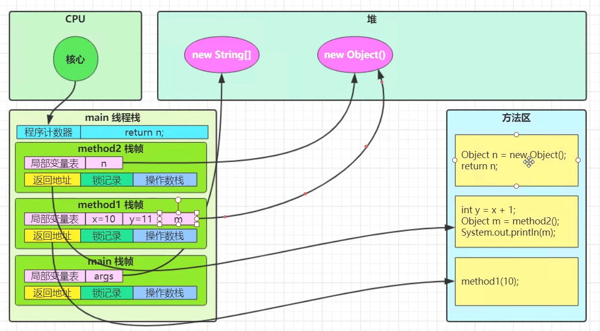

## JVM



JVM 内存结构
├── 堆 (Heap)               ← 存放对象实例  
│   ├── 新生代 (Young Generation)  
│   │   ├── Eden 区  
│   │   ├── Survivor 0 区  
│   │   └── Survivor 1 区  
│   └── 老年代 (Old Generation)  
│
├── 方法区 (Method Area)     ← 存放类的元数据  
│   ├── JDK 7 及以前：永久代 (PermGen)  
│   └── JDK 8 及以后：元空间 (Metaspace)  
│
├── 栈 (Stack)               ← 每个线程独立，存放局部变量表  
│   ├── 局部变量  
│   ├── 操作数栈  
│   └── 帧 (Frame)  
│
├── 本地方法栈 (Native Method Stack) ← 专门为本地 (native) 方法服务  
│
├── 程序计数器 (PC Register)  ← 记录当前线程正在执行的字节码行号  
│
└── 直接内存 (Direct Memory)  ← 堆外内存，如NIO中的ByteBuffer  

#### 内存调优常用参数

---

#### **一、堆内存调优**

| 参数                        | 作用                  |
| ------------------------- | ------------------- |
| `-Xms512m`                | 初始堆大小               |
| `-Xmx1024m`               | 最大堆大小               |
| `-Xmn256m`                | 新生代大小               |
| `-XX:NewRatio=2`          | 老年代:新生代的比例          |
| `-XX:SurvivorRatio=8`     | Eden区\:Survivor区的比例 |
| `-XX:MaxHeapFreeRatio=70` | 最大堆空闲比例             |
| `-XX:MinHeapFreeRatio=40` | 最小堆空闲比例             |

---

#### **二、元空间/永久代调优**

| 参数                          | 作用                 |
| --------------------------- | ------------------ |
| `-XX:MetaspaceSize=256m`    | 元空间初始大小 (JDK 8+)   |
| `-XX:MaxMetaspaceSize=512m` | 元空间最大大小 (JDK 8+)   |
| `-XX:PermSize=256m`         | 永久代初始大小 (JDK 7及以前) |
| `-XX:MaxPermSize=512m`      | 永久代最大大小 (JDK 7及以前) |

---

#### **三、GC垃圾收集器调优**

#### 1）选择垃圾收集器

| 参数                        | 作用                  |
| ------------------------- | ------------------- |
| `-XX:+UseSerialGC`        | 使用串行垃圾回收器           |
| `-XX:+UseParallelGC`      | 使用并行垃圾回收器 (吞吐量优先)   |
| `-XX:+UseConcMarkSweepGC` | 使用CMS垃圾回收器          |
| `-XX:+UseG1GC`            | 使用G1垃圾回收器 (JDK 9推荐) |

#### 2）GC行为调优

| 参数                                 | 作用                  |
| ---------------------------------- | ------------------- |
| `-XX:MaxGCPauseMillis=200`         | 最大GC暂停时间 (毫秒)       |
| `-XX:+UseAdaptiveSizePolicy`       | 动态调整堆大小和区大小         |
| `-XX:+ExplicitGCInvokesConcurrent` | `System.gc()`触发并发GC |

---

#### **四、线程栈调优**

| 参数         | 作用         |
| ---------- | ---------- |
| `-Xss512k` | 设置每个线程的栈大小 |

---

#### **五、JIT 编译器调优**

| 参数                           | 作用            |
| ---------------------------- | ------------- |
| `-XX:+TieredCompilation`     | 启用分层编译        |
| `-XX:CompileThreshold=10000` | 方法调用次数到达阈值时编译 |

---

#### **六、日志和诊断调优**

| 参数                                     | 作用             |
| -------------------------------------- | -------------- |
| `-verbose:gc`                          | 打印GC日志         |
| `-Xlog:gc`                             | (JDK9+) 打印GC日志 |
| `-XX:+PrintGCDetails`                  | 打印GC详细信息       |
| `-XX:+PrintGCDateStamps`               | 打印GC时间戳        |
| `-XX:+HeapDumpOnOutOfMemoryError`      | OOM时生成堆转储文件    |
| `-XX:HeapDumpPath=/path/to/dump.hprof` | 堆转储文件保存路径      |

---

#### **七、直接内存 / NIO 调优**

| 参数                             | 作用               |
| ------------------------------ | ---------------- |
| `-XX:MaxDirectMemorySize=512m` | 最大直接内存大小 (NIO相关) |

---

#### **八、其他常用调优**

| 参数                              | 作用         |
| ------------------------------- | ---------- |
| `-Dfile.encoding=UTF-8`         | 设置文件编码     |
| `-Duser.timezone=Asia/Shanghai` | 设置时区       |
| `-server`                       | 使用服务端JVM模式 |

---

#### **实战：生产环境常用组合**

```bash
-Xms512m -Xmx1024m -Xmn256m
-XX:MetaspaceSize=128m -XX:MaxMetaspaceSize=256m
-XX:+UseG1GC -XX:MaxGCPauseMillis=200
-XX:+PrintGCDetails -XX:+PrintGCDateStamps -Xloggc:gc.log
-XX:+HeapDumpOnOutOfMemoryError -XX:HeapDumpPath=./dump.hprof
-XX:MaxDirectMemorySize=256m
-Dfile.encoding=UTF-8 -Duser.timezone=Asia/Shanghai
```

---

#### **Bonus：JDK 11+ G1GC 推荐设置**

```bash
-XX:+UseG1GC
-XX:MaxGCPauseMillis=200
-XX:InitiatingHeapOccupancyPercent=45
-XX:+ParallelRefProcEnabled
```

---

JVM垃圾回收器（GC）优缺点对比

---

#### **JVM 垃圾回收器优缺点对比**

| GC回收器                           | 优点                  | 缺点               | 适用场景             |
| ------------------------------- | ------------------- | ---------------- | ---------------- |
| **Serial GC**                   | 简单、单线程、内存小、适合单核CPU  | 停顿时间长 (STW)，吞吐量低 | 小型应用、客户端程序       |
| **Parallel GC**                 | 吞吐量高、并行处理           | 停顿时间可能不稳定        | 后台批处理、大吞吐应用      |
| **CMS (Concurrent Mark Sweep)** | 并发标记、低延迟 (短停顿)      | 内存碎片多、并发阶段CPU竞争  | 响应时间敏感型，如Web服务   |
| **G1 GC**                       | 停顿可预测、内存碎片少、并行、并发   | 参数复杂、内存占用略高      | 大堆 (4GB+)、延迟敏感系统 |
| **ZGC (JDK11+)**                | 超低延迟 (<10ms)、TB级堆支持 | 吞吐偏低、还不适合所有场景    | 超大堆、金融、电信、游戏     |
| **Shenandoah (JDK12+)**         | 低延迟 (<10ms)、并发回收    | 吞吐略低、支持性还在完善     | 大内存、低延迟Java服务    |

---


#### **主流选择建议**

| 场景             | 推荐GC                         |
| -------------- | ---------------------------- |
| 小型、简单任务        | **Serial GC**                |
| 吞吐优先（如批处理、大数据） | **Parallel GC**              |
| 响应时间敏感（如Web服务） | **CMS / G1 GC**              |
| 现代大堆 + 低延迟     | **G1 GC / ZGC / Shenandoah** |

---

#### **补充：CMS vs G1 对比**

| 特点    | CMS               | G1 GC         |
| ----- | ----------------- | ------------- |
| 停顿时间  | 短，但不可预测           | 停顿可预测         |
| 碎片问题  | 有                 | 几乎无           |
| 吞吐量   | 略高                | 稍低            |
| 参数复杂度 | 简单                | 较复杂           |
| 官方推荐  | 已被**淘汰**（JDK 14起） | **推荐**（JDK9+） |

---


### visualvm
VisualVM是一个开源的Java性能监控工具，它提供了多种功能，如查看内存、查看线程、查看类加载器、查看类信息、查看方法信息、查看方法调用、查看方法调用链、查看方法调用树、查看方法调用关系、查看方法调用关系图、查看方法调用关系树、查看方法调用关系图、

### Arthas(阿尔萨斯)
Arthas是一个Java诊断工具，用于实时监控和修改JVM运行时状态。它提供了许多命令，用于查看和修改JVM的状态，如查看堆栈、查看内存、查看线程、查看类加载器、查看类信息、查看方法信息、查看方法调用、查看方法调用链、查看方法调用树、查看方法调用图、查看方法调用关系、查看方法调用关系图、查看方法调用关系树、查看方法调用关系图、查看方法调用关系树、查看方法调用关系图、查看方法调用关系树、查看方法调用关系图、查看方法调用关系树、查看方法调用关系图、查看方法调用关系树、


#### 选择应用 java 进程
```shell
$ $ java -jar arthas-boot.jar
* [1]: 35542
  [2]: 71560 math-game.jar
```

#### 输入 2，再输入回车/enter。Arthas 会 attach 到目标进程上，并输出日志：
```shell
[INFO] Try to attach process 71560
[INFO] Attach process 71560 success.
[INFO] arthas-client connect 127.0.0.1 3658
  ,---.  ,------. ,--------.,--.  ,--.  ,---.   ,---.
 /  O  \ |  .--. ''--.  .--'|  '--'  | /  O  \ '   .-'
|  .-.  ||  '--'.'   |  |   |  .--.  ||  .-.  |`.  `-.
|  | |  ||  |\  \    |  |   |  |  |  ||  | |  |.-'    |
`--' `--'`--' '--'   `--'   `--'  `--'`--' `--'`-----'


wiki: https://arthas.aliyun.com/doc
version: 3.0.5.20181127201536
pid: 71560
time: 2018-11-28 19:16:24

$
```

#### 输入dashboard，按回车/enter，会展示当前进程的信息，按ctrl+c可以中断执行。
```shell
$ dashboard
ID     NAME                   GROUP          PRIORI STATE  %CPU    TIME   INTERRU DAEMON
17     pool-2-thread-1        system         5      WAITIN 67      0:0    false   false
27     Timer-for-arthas-dashb system         10     RUNNAB 32      0:0    false   true
11     AsyncAppender-Worker-a system         9      WAITIN 0       0:0    false   true
9      Attach Listener        system         9      RUNNAB 0       0:0    false   true
3      Finalizer              system         8      WAITIN 0       0:0    false   true
2      Reference Handler      system         10     WAITIN 0       0:0    false   true
4      Signal Dispatcher      system         9      RUNNAB 0       0:0    false   true
26     as-command-execute-dae system         10     TIMED_ 0       0:0    false   true
13     job-timeout            system         9      TIMED_ 0       0:0    false   true
1      main                   main           5      TIMED_ 0       0:0    false   false
14     nioEventLoopGroup-2-1  system         10     RUNNAB 0       0:0    false   false
18     nioEventLoopGroup-2-2  system         10     RUNNAB 0       0:0    false   false
23     nioEventLoopGroup-2-3  system         10     RUNNAB 0       0:0    false   false
15     nioEventLoopGroup-3-1  system         10     RUNNAB 0       0:0    false   false
Memory             used   total max    usage GC
heap               32M    155M  1820M  1.77% gc.ps_scavenge.count  4
ps_eden_space      14M    65M   672M   2.21% gc.ps_scavenge.time(m 166
ps_survivor_space  4M     5M    5M           s)
ps_old_gen         12M    85M   1365M  0.91% gc.ps_marksweep.count 0
nonheap            20M    23M   -1           gc.ps_marksweep.time( 0
code_cache         3M     5M    240M   1.32% ms)
Runtime
os.name                Mac OS X
os.version             10.13.4
java.version           1.8.0_162
java.home              /Library/Java/JavaVir
                       tualMachines/jdk1.8.0
                       _162.jdk/Contents/Hom
                       e/jre
```

#### 通过 thread 命令来获取到math-game进程的 Main Class
```shell
$ thread 1 | grep 'main('
    at demo.MathGame.main(MathGame.java:17)
```

#### 通过 jad 来反编译 Main Class
```java
$ jad demo.MathGame

ClassLoader:
+-sun.misc.Launcher$AppClassLoader@3d4eac69
  +-sun.misc.Launcher$ExtClassLoader@66350f69

Location:
/tmp/math-game.jar

/*
 * Decompiled with CFR 0_132.
 */
package demo;

import java.io.PrintStream;
import java.util.ArrayList;
import java.util.Iterator;
import java.util.List;
import java.util.Random;
import java.util.concurrent.TimeUnit;

public class MathGame {
    private static Random random = new Random();
    private int illegalArgumentCount = 0;

    public static void main(String[] args) throws InterruptedException {
        MathGame game = new MathGame();
        do {
            game.run();
            TimeUnit.SECONDS.sleep(1L);
        } while (true);
    }

    public void run() throws InterruptedException {
        try {
            int number = random.nextInt();
            List<Integer> primeFactors = this.primeFactors(number);
            MathGame.print(number, primeFactors);
        }
        catch (Exception e) {
            System.out.println(String.format("illegalArgumentCount:%3d, ", this.illegalArgumentCount) + e.getMessage());
        }
    }

    public static void print(int number, List<Integer> primeFactors) {
        StringBuffer sb = new StringBuffer("" + number + "=");
        Iterator<Integer> iterator = primeFactors.iterator();
        while (iterator.hasNext()) {
            int factor = iterator.next();
            sb.append(factor).append('*');
        }
        if (sb.charAt(sb.length() - 1) == '*') {
            sb.deleteCharAt(sb.length() - 1);
        }
        System.out.println(sb);
    }

    public List<Integer> primeFactors(int number) {
        if (number < 2) {
            ++this.illegalArgumentCount;
            throw new IllegalArgumentException("number is: " + number + ", need >= 2");
        }
        ArrayList<Integer> result = new ArrayList<Integer>();
        int i = 2;
        while (i <= number) {
            if (number % i == 0) {
                result.add(i);
                number /= i;
                i = 2;
                continue;
            }
            ++i;
        }
        return result;
    }
}

Affect(row-cnt:1) cost in 970 ms.
```
#### watch
````java
$ watch demo.MathGame primeFactors returnObj
Press Ctrl+C to abort.
Affect(class-cnt:1 , method-cnt:1) cost in 107 ms.
ts=2018-11-28 19:22:30; [cost=1.715367ms] result=null
ts=2018-11-28 19:22:31; [cost=0.185203ms] result=null
ts=2018-11-28 19:22:32; [cost=19.012416ms] result=@ArrayList[
    @Integer[5],
    @Integer[47],
    @Integer[2675531],
]
ts=2018-11-28 19:22:33; [cost=0.311395ms] result=@ArrayList[
    @Integer[2],
    @Integer[5],
    @Integer[317],
    @Integer[503],
    @Integer[887],
]
ts=2018-11-28 19:22:34; [cost=10.136007ms] result=@ArrayList[
    @Integer[2],
    @Integer[2],
    @Integer[3],
    @Integer[3],
    @Integer[31],
    @Integer[717593],
]
ts=2018-11-28 19:22:35; [cost=29.969732ms] result=@ArrayList[
    @Integer[5],
    @Integer[29],
    @Integer[7651739],
]
````


