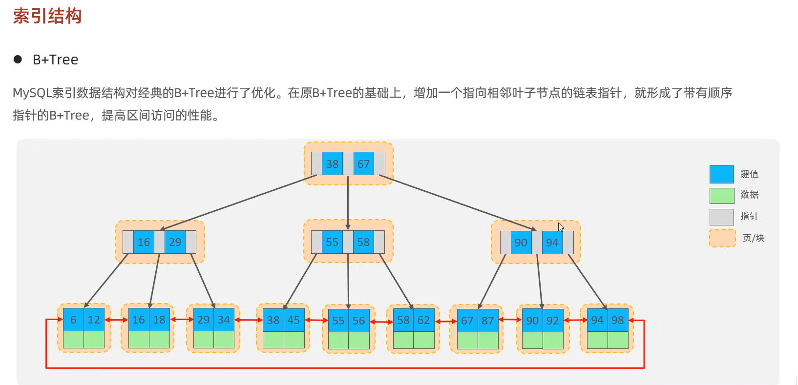
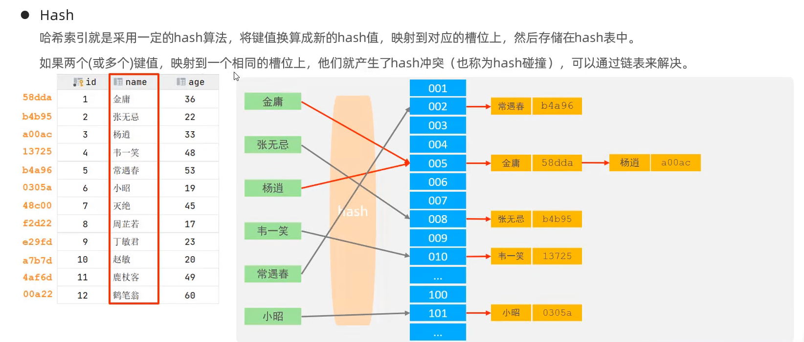
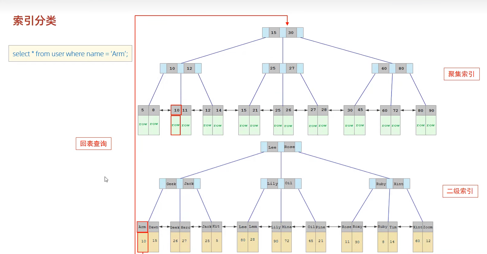

## mysql

### 索引结构
- B+Tree  

- Hash  
采用hash算法，将数据存储在hash表中，查询时，根据hash值进行查询  

1. Hash索引只能用于对等比较（= ，in），不支持范围查询（between，>,<,...）
2. 无法利用索引完成排序操作
3. 查询效率高，通常只需要一次检索就可以了，效率通常要高于b+tree索引
### 索引分类
- 主键索引 ，只能有一个
- 唯一索引 ，可以有多个
- 常规索引 ，可以有多个
- 全文索引 ，可以有多个

### InnoDB
#### 索引分类
- 聚集索引
1. 如果存在主键，则主键就是聚集索引
2. 如果不存在主键，将使用第一个唯一索引作为聚集索引
3. 没有主键，且没有唯一索引，InnoDB自动创建一个rowid作为隐藏的聚集索引
- 非聚集索引
#### 回表


#### 索引语法
- 创建索引  
```mysql
CREATE [UNIQUE|FULLTEXT] INDEX index_name ON tbl_name (index_col_name,...);
```
- 查看索引
```mysql
SHOW  INDEX FROM tbl_name;
```
- 删除索引
```mysql
Drop INDEX index_name ON tbl_name;
```
### SQL性能分析
- SQL执行频率
```mysql
show [session|global] status like 'Com_______';
```
- 慢查询日志  
1. Mysql的慢查询日志，记录了所有超过指定时间的SQL语句，可以查看SQL语句的运行情况，包括执行时间，执行次数等。  
2. 默认慢查询日志的记录时间是10秒，可以通过设置参数slow_query_log=1，slow_query_log_file=/var/log/mysql/mysql-slow.log，来开启慢查询日志。
```lombok.config
#开启Mysql的慢查询日志
slow_query_log = 1
#设置慢查询日志的记录时间
long_query_time = 2
```
- profile详情  
1. 是否支持profile操作
```sql
select @@hava_profiling;
```

2. 开启profile
```sql
set profiling = 1;
```
3. 查看profile详情
```sql
# 查看所有profile详情
show profiles;

# 查看指定profile详情
show profile for query query_id;

# 查看指定profile的cpu详情
show profile cpu  for query query_id;
```
 - explain
 1. 字段含义介绍  
id：select查询的序号
